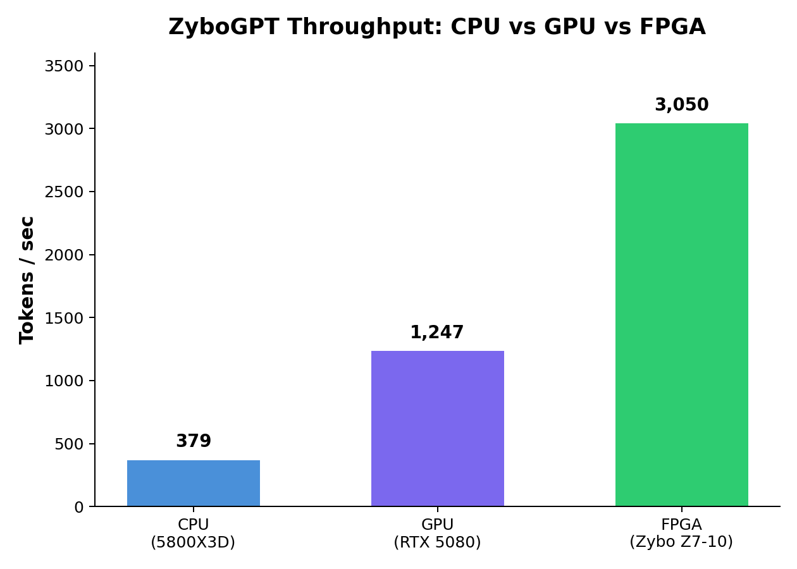
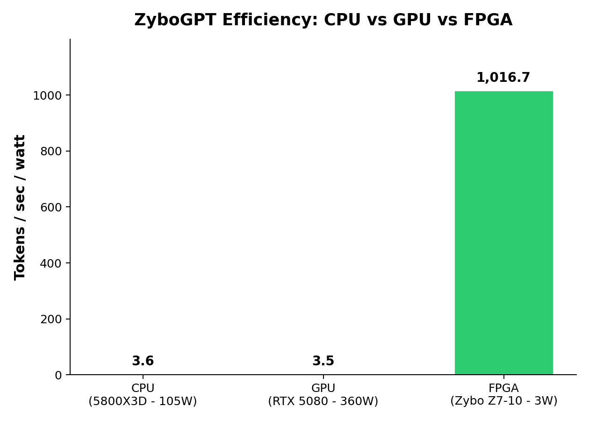

# ZyboGPT

A ternary-quantized character-level LLM running entirely on a Zybo Z7-10 FPGA (Zynq xc7z010clg400-1). Weights are {-1, 0, +1}, activations are INT8, and the entire model fits in on-chip BRAM with no external memory access during inference.

Ternary weight packing uses the TerEffic 1.6-bit scheme (5 trits per byte), based on the [TerEffic paper](https://arxiv.org/abs/2502.16473) (arXiv:2502.16473).

## Demo

https://github.com/user-attachments/assets/90ed3351-190a-44ca-80b8-e881e6ce4f7b

## Performance

| Metric | Value |
|--------|-------|
| On-hardware throughput | 3,072 tok/s |
| Simulation throughput | 5,441 tok/s |
| Clock frequency | 150 MHz |
| Board power | ~2-3 W |

<p align="center">
  
  
</p>

The $200 Zybo Z7-10 outperforms both a Ryzen 5800X3D (8×) and an RTX 5080 (2.4×) in raw decode throughput on the same model — and delivers **290× better power efficiency** than the GPU (1,017 vs 3.5 tok/s/W).

### Resource Utilization

| Resource | Used | Available | Util% |
|----------|------|-----------|-------|
| Slice LUTs | 14,952 | 17,600 | 85% |
| Slice Registers | 13,317 | 35,200 | 38% |
| Block RAM | 30.5 tiles | 60 | 51% |
| DSP48E1 | 67 | 80 | 84% |

### Model

| Parameter | Value |
|-----------|-------|
| Vocabulary | 128 (ASCII) |
| Embedding dim | 64 |
| Attention heads | 2 |
| Layers | 2 |
| FFN hidden dim | 256 |
| Context length | 128 |
| Parameters | ~115K (~98K ternary + ~17K full-precision) |
| Training data | Tiny Shakespeare |

## Benchmark Methodology

`make benchmark` runs a cross-platform comparison of autoregressive decode throughput (tok/s) on the same model:

- **CPU**: PyTorch FP32 inference, autoregressive decode (greedy argmax) with KV cache. 5 warmup runs, then 20 timed runs of 64 generated tokens each. Throughput = total tokens / wall-clock time (`time.perf_counter`).
- **GPU**: Same as CPU but with `torch.compile(dynamic=True)` and CUDA event timing (`torch.cuda.Event`). 5 warmup runs, 20 timed runs. The GPU model is dynamically detected via `torch.cuda.get_device_name()`.
- **FPGA**: The firmware's `BENCH` command runs continuous autoregressive generation (alternating "ROMEO:"/"JULIET:" prompts) for up to 5 minutes. The accelerator's hardware cycle counter measures elapsed time at cycle granularity. Throughput = total tokens * 150 MHz / total cycles, computed on-device and reported over UART.

All three platforms run the identical model architecture and weights. The CPU/GPU benchmarks use the FP32 PyTorch model (with ternary weight STE and KV caching), while the FPGA runs the fully quantized INT8+ternary hardware implementation. The prompt is "ROMEO:" in all cases.

The comparison is not apples-to-apples in the traditional sense: the FPGA runs a fully quantized model hardwired into fabric, while CPU/GPU run the float training model through a general-purpose deep learning framework. The point is to show that a tiny ternary model on a $200 FPGA can match or exceed the throughput of general-purpose hardware running the same model through PyTorch.

## Prerequisites

- **Python 3.11+** with PyTorch (CUDA optional)
- **JDK 11+** and **sbt** (for SpinalHDL)
- **Verilator** (for RTL simulation)
- **Vivado 2024.1** (for synthesis, implementation, and bitstream generation)
- **Rust nightly** (for bare-metal firmware; auto-configured by `rust-toolchain.toml`)

## Quickstart

```bash
# 1. Set up Python environment
python -m venv venv
source venv/bin/activate
pip install -r python/train/requirements.txt

# 2. Train the model (two-phase curriculum)
make train

# 3. Export weights to FPGA format
make export

# 4. Validate quantized model against float reference
make validate

# 5. Run SpinalHDL simulations (all 11 tests)
make spinal-test

# 6. Generate Verilog
make spinal

# 7. Synthesize, implement, and generate bitstream
make vivado-bit

# 8. Build bare-metal firmware
make rust

# 9. Flash bitstream + firmware to board
make flash

# 10. Interactive console
make console
```

## Project Structure

```
ZyboGPT/
  Makefile                 # Top-level build orchestration
  python/train/            # Training pipeline
    requirements.txt       #   Python dependencies
    config.py              #   Model and training hyperparameters
    bitlinear.py           #   Ternary weight + INT8 activation quantization (STE)
    model.py               #   Transformer model (RMSNorm, Attention, FFN)
    train.py               #   Training loop (two-phase curriculum)
    export.py              #   Export to hardware formats
    reference_inference.py #   Bit-accurate INT8 inference for RTL validation
    tokenizer.py           #   ASCII tokenizer (0-127)
    dataset.py             #   Tiny Shakespeare dataset
  hw/src/main/scala/       # SpinalHDL RTL
    zybogpt/
      ZyboGPT.scala        #   Top-level + TDot controller
      Sequencer.scala      #   Inference FSM
      Attention.scala      #   Multi-head attention
      FeedForward.scala    #   FFN (up -> ReLU -> down)
      TDotUnit.scala       #   64-wide ternary dot product
      WeightBram.scala     #   Packed weight storage + serial TDot
      Embedding.scala      #   Token/pos embedding + 8x parallel logit
      RMSNorm.scala        #   Integer RMSNorm (inv_sqrt LUT)
      Softmax.scala        #   Integer softmax (piecewise-linear exp)
      SamplingUnit.scala   #   Temperature sampling (Galois LFSR)
      KvCache.scala        #   KV cache BRAM
      Int8MacArray.scala   #   8 parallel INT8 MACs
      ...                  #   (see hw/README.md for full list)
  hw/src/test/scala/       # SpinalHDL simulation testbenches (11 tests)
  rust/src/                # Bare-metal Zynq firmware
    main.rs                #   Entry point, generation loop
    accelerator.rs         #   AXI-Lite MMIO interface
    uart.rs                #   UART1 driver (115200 8N1)
    protocol.rs            #   Command parsing
    tokenizer.rs           #   ASCII tokenizer
  scripts/                 # Build pipeline and tools
    generate_weights.py    #   Export checkpoint -> BRAM init files
    validate_model.py      #   FP32 vs INT8 comparison + test vector gen
    update_test_refs.py    #   Update Scala test references from JSON
    cmd.py                 #   Interactive console (UART + XSDB fallback)
    benchmark.py           #   Cross-platform throughput benchmark
    board.py               #   Board communication (serial, XSDB mailbox)
    generate.py            #   Float text generation
    flash.tcl              #   XSDB flash script
  vivado/                  # Vivado TCL scripts
    create_project.tcl     #   Create Vivado project + block design
    run_synth.tcl          #   Run synthesis
    run_impl.tcl           #   Run implementation
    run_bitstream.tcl      #   Generate bitstream
    report_hierarchy.tcl   #   Hierarchical utilization report
  hw/constraints/
    zybo_z7_10.xdc         # Timing constraints
```

## Build Pipeline

```
make train -> make export -> make validate -> make spinal-test -> make spinal -> make vivado-bit -> make rust -> make flash
```

| Phase | Target | Description |
|-------|--------|-------------|
| Training | `make train` | Two-phase curriculum: float pretrain + HW-mode fine-tune |
| Export | `make export` | Convert checkpoint to .mem/.coe BRAM init files |
| Validation | `make validate` | Compare FP32 vs INT8 inference, generate test vectors |
| Simulation | `make spinal-test` | Run all 11 SpinalHDL testbenches via Verilator |
| Verilog | `make spinal` | Generate `hw/gen/ZyboGPTTop.v` |
| Synthesis | `make vivado-bit` | Full Vivado flow: synth -> impl -> bitstream |
| Firmware | `make rust` | Build bare-metal Rust firmware |
| Deploy | `make flash` | Program bitstream + firmware via XSDB |
| Console | `make console` | Interactive text generation terminal |
| Benchmark | `make benchmark` | CPU/GPU/FPGA throughput comparison |

## Architecture

The accelerator uses a time-multiplexed design: both transformer layers share a single TDot unit (ternary dot product) and 8 INT8 MACs. All weights are stored in BRAM and decoded from 1.6-bit packed ternary format at runtime.

Key design choices:
- **Ternary weights**: {-1, 0, +1} with 5-trits-per-byte packing ([TerEffic](https://arxiv.org/abs/2502.16473) scheme)
- **INT8 activations**: Saturating clamp at every stage boundary
- **BRAM-backed buffers**: Avoids mux tree explosion from Vec(Reg()) (reduced LUTs from 128K to 15K)
- **Serial compute**: Single TDotUnit processes 32 output rows sequentially
- **8x parallel logit**: Wide BRAM (128-bit) reads 8 INT16 embedding values per cycle

See `hw/README.md` for detailed architecture documentation, `hw/src/main/scala/zybogpt/LUT_ANALYSIS.md` for the optimization journey.

## AXI Register Map

Base address: `0x43C0_0000`

| Offset | Name | Description |
|--------|------|-------------|
| 0x00 | CONTROL | [0] start |
| 0x04 | STATUS | [0] busy, [1] done |
| 0x08 | TOKEN_IN | [6:0] input token |
| 0x0C | TOKEN_OUT | [6:0] output token |
| 0x10 | POSITION | [6:0] sequence position |
| 0x14 | CYCLE_LO | Cycle counter [31:0] |
| 0x18 | CYCLE_HI | Cycle counter [63:32] |
| 0x1C | CONFIG | Model config packed |
| 0x20 | SAMPLING | [15:0] inv_temp (0 = greedy) |
| 0x24 | SEED | [31:0] LFSR seed |

## Testing

```bash
# All 11 SpinalHDL simulation tests
make spinal-test

# Integration test: 16-token generation, bit-accurate match vs Python
make romeo-test

# Per-stage pipeline debug (16 stages, zero tolerance)
make pipeline-debug
```

## Porting to Other FPGAs

The design targets the Zybo Z7-10 (xc7z010clg400-1), a small Zynq-7000 SoC. To port to a different FPGA:

1. **Constraints**: Replace `hw/constraints/zybo_z7_10.xdc` with pin assignments and clock constraints for your board.
2. **Block design**: Update `vivado/block_design.tcl` to match your Zynq PS configuration (or replace the Zynq PS with a soft-core or custom AXI master for non-Zynq parts).
3. **Clock frequency**: The design closes timing at 150 MHz on 7-series with ~0 ns slack. Larger FPGAs (Z7-20, Artix-7 200T, etc.) will close more easily and may support higher clocks. Smaller parts may require reducing parallelism or clock speed.
4. **BRAM budget**: The model uses 30.5 of 60 BRAM tiles. Any FPGA with at least 32 BRAM18K tiles can fit the weights. Larger FPGAs could support bigger models.
5. **DSP budget**: 67 of 80 DSP48E1 slices are used. FPGAs with fewer DSPs will need the `Flow_AreaOptimized_high` synthesis strategy relaxed, trading DSPs for LUTs.
6. **Firmware**: The bare-metal Rust firmware targets ARM Cortex-A9 (Zynq PS). For non-Zynq FPGAs, replace it with a MicroBlaze/RISC-V soft-core equivalent or drive the accelerator from an external host over AXI.

The RTL itself (SpinalHDL/Verilog) is vendor-agnostic and uses only standard BRAM and DSP48E1 primitives.

## Platform Support

Developed and tested on Linux (Arch). The toolchain (Python, sbt, Verilator, Vivado, Rust) is cross-platform in principle, but the Makefile, shell scripts, and XSDB integration assume a Unix environment. Windows users may need WSL or equivalent. macOS should work for training, simulation, and firmware compilation, but Vivado requires Linux.
