# ZyboGPT Hardware Architecture — Deep Dive Guide

A bottom-up guide to how a ternary-quantized transformer (ZyboGPT-Tiny) runs entirely on a Zybo Z7-10 FPGA. Covers every module from AXI register writes to token output.

**Model**: vocab=128 (ASCII), d_model=64, n_heads=2, n_layers=2, d_ff=256, ctx_len=128. ~115K ternary parameters + ~8.4K full-precision parameters.

---

## Table of Contents

1. [The Big Picture](#section-1-the-big-picture)
2. [Number Representation](#section-2-number-representation)
3. [Weight Storage and Decoding](#section-3-weight-storage-and-decoding)
4. [The Ternary Dot Product](#section-4-the-ternary-dot-product)
5. [The INT8 MAC Array](#section-5-the-int8-mac-array)
6. [RMSNorm — Integer Normalization](#section-6-rmsnorm--integer-normalization)
7. [Softmax — Integer Probability](#section-7-softmax--integer-probability)
8. [Attention — The Core of the Transformer](#section-8-attention--the-core-of-the-transformer)
9. [Feed-Forward Network](#section-9-feed-forward-network)
10. [KV Cache](#section-10-kv-cache)
11. [Embedding and Logit Computation](#section-11-embedding-and-logit-computation)
12. [Temperature Sampling](#section-12-temperature-sampling)
13. [The Transformer Layer](#section-13-the-transformer-layer)
14. [The Sequencer — Master Controller](#section-14-the-sequencer--master-controller)
15. [Putting It All Together — Full Token Inference](#section-15-putting-it-all-together--full-token-inference)
16. [Resource Budget](#section-16-resource-budget)

---

## Section 1: The Big Picture

**File: `hw/src/main/scala/zybogpt/ZyboGPT.scala`**

The Zynq PS (ARM Cortex-A9) talks to the PL (FPGA fabric) through a single AXI4-Lite bus. The firmware writes a token ID and a position, pulses "start", and some thousands of cycles later reads back the predicted next token.

### AXI Register Map

**File: `hw/src/main/scala/zybogpt/AxiLiteSlave.scala`** (base address `0x43C0_0000`)

| Offset | Name       | R/W | Bits     | Description |
|--------|------------|-----|----------|-------------|
| 0x00   | CONTROL    | W   | [2:0]    | start, reset, mode. Start is a **rising-edge detector** — the slave latches the previous value and fires on `0→1` transitions. |
| 0x04   | STATUS     | R   | [1:0]    | bit 0 = busy, bit 1 = done. Done is **latched** after inference completes and cleared on the next start pulse. |
| 0x08   | TOKEN_IN   | W   | [6:0]    | 7-bit input token ID (0–127, ASCII). |
| 0x0C   | TOKEN_OUT  | R   | [6:0]    | 7-bit predicted next token. |
| 0x10   | POSITION   | W   | [6:0]    | Sequence position for KV cache placement. |
| 0x14   | CYCLE_LO   | R   | [31:0]   | Hardware cycle counter — runs while state != IDLE, for precise benchmarking. |
| 0x1C   | CONFIG     | R   | [31:0]   | Read-only model config: `[7:0]=dModel`, `[15:8]=nLayers`, `[23:16]=ctxLen`, `[31:24]=vocabSize`. |
| 0x20   | SAMPLING   | R/W | [15:0]   | `invTemp`: inverse temperature for sampling. 0 = greedy argmax, 512 = T=0.5. |
| 0x24   | SEED       | R/W | [31:0]   | LFSR seed. Writing triggers a single-cycle `seedLoad` pulse. |

The write channel FSM latches AW and W phases independently, performs the register write when both arrive, and sends a B response. The read channel is a simple valid/ready handshake with an address-to-register mux.

### Sub-Modules

`ZyboGPTTop` (`ZyboGPT.scala:22`) instantiates 8 sub-modules:

| Module | Instance | Role |
|--------|----------|------|
| `AxiLiteSlave` | `axiSlave` | PS ↔ PL register interface |
| `Sequencer` | `sequencer` | Master inference FSM — orchestrates all phases |
| `Embedding` | `embedding` | Token + position embedding lookup, and logit computation |
| `TransformerLayer` | `transformerLayer` | One reusable decoder layer (attention + FFN), invoked twice |
| `Int8MacArray` | `macArray` | 8 parallel INT8 multiply-accumulate units for attention |
| `KvCache` | `kvCache` | Key/Value storage for both layers and heads |
| `WeightBram` | `weightBram` | All ternary weights + single TDotUnit + weight decoder |
| `RMSNorm` | `finalNorm` | Final layer normalization (before logit projection) |

### Block Diagram

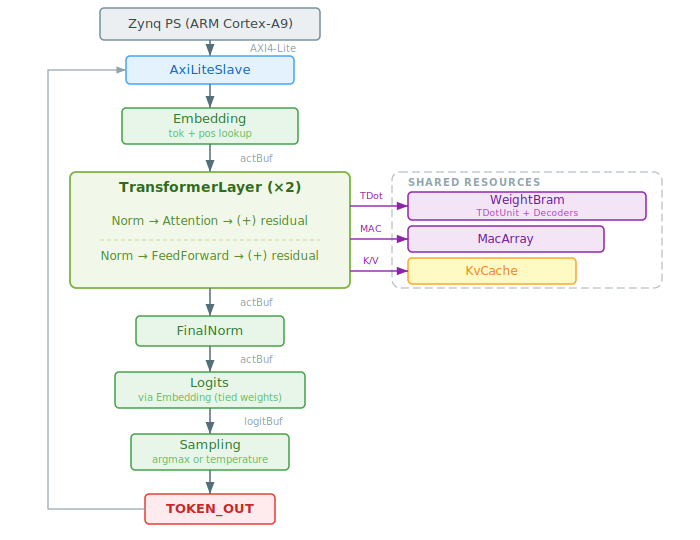

The TDot interface (ternary dot product) is a **shared resource** — `ZyboGPTTop` contains a TDot Controller FSM (`IDLE → LOADING → COMPUTE → DONE`, lines 82–119) that arbitrates weight loading and computation. Both Attention and FeedForward use TDot but never concurrently.

A single shared `normGammaMem` BRAM (320 entries of INT16, lines 152–195) stores all RMSNorm gammas: 5 norms × 64 dims. The TransformerLayer computes the full address as `normGammaBase + localOffset`.

---

## Section 2: Number Representation

**File: `hw/src/main/scala/zybogpt/Config.scala`**

Four number formats flow through the design:

### INT8 Activations — `SInt(8 bits)`

All intermediate values between pipeline stages are clamped to [-128, 127] via `SatInt8()` (Config.scala:90–108). This is the universal "wire format." `SatInt8` is a saturating clamp — values above 127 become 127, below -128 become -128 — preventing wrap-around artifacts that would corrupt inference.

### Ternary Weights — `Bits(2 bits)`

Each weight is one of three values: `00` = 0, `01` = +1, `11` = -1. Stored packed as 5-trits-per-byte using the TerEffic scheme (see Section 3a).

### INT16 Fixed-Point — `SInt(16 bits)`

Q5.10 format (10 fractional bits, so 1.0 = 1024). Used for:
- **Token/position embeddings**: learned lookup tables in Q5.10
- **RMSNorm gammas**: scale factors clamped to [-2.0, 2.0] during training
- **Attention scores**: Q·K^T results before softmax
- **Weight scales**: per-layer normalization factors

### INT24 Accumulators — `SInt(24 bits)`

Dot product results before saturation. The 24-bit range (up to 8,388,607) safely accommodates:
- Ternary dot products: max |64 × 127 × 1| = 8,128
- MAC accumulations: max |32 × 127 × 127| = 516,382
- FFN accumulations across 4 passes: max |4 × 8,128| = 32,512

Key constants from Config.scala:
- `actBits = 8`, `accumBits = 24`, `fracBits = 10`, `normBits = 16`
- `numTDots = 32` (outputs per TDot invocation)
- `numDspMacs = 8` (parallel INT8 MAC lanes)
- `tdotWidth = 64` (= dModel, input width of each dot product)

---

## Section 3: Weight Storage and Decoding

**Files: `WeightBram.scala`, `WeightDecoder.scala`, `Config.scala`**

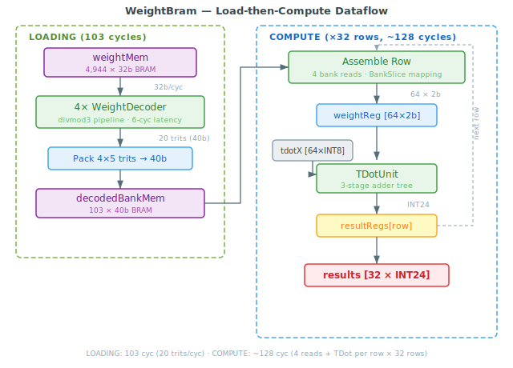

### 3a: TerEffic Packing

Five ternary trits (each from {-1, 0, +1}) are packed into one byte using base-3 encoding. Each trit `ti` is mapped as: -1→0, 0→1, +1→2. The packed value is:

```
packed = t0 + 3*t1 + 9*t2 + 27*t3 + 81*t4
```

Range: 0–242, which fits in a byte. This achieves 1.6-bit effective density (5 trits in 8 bits vs. the theoretical 5 × log2(3) ≈ 7.92 bits).

### 3b: WeightDecoder Pipeline

**File: `WeightDecoder.scala`**

The `WeightDecoder` (lines 1–100) reverses the packing in a 5-stage pipeline. Each stage performs a divide-by-3 via the multiply-and-shift trick `q = (r * 171) >> 9` (lines 31–35), extracting one trit as the remainder. The remainder is mapped back to the 2-bit ternary encoding: `0→11` (-1), `1→00` (0), `2→01` (+1) by the `mapTrit()` function (lines 38–45).

Four `WeightDecoder` instances run in parallel (bundled in `WeightDecoderBank`, lines 104–137), matching the 32-bit BRAM read width: 4 bytes = 20 trits per cycle. The `WeightDecoderBank` distributes 4 × 32-bit words across 16 decoders (16 × 5 = 80 trits/cycle for the full bank, though only 4 decoders × 5 = 20 trits are used per BRAM word in practice).

Latency: 6 cycles from packed byte to decoded trits.

### 3c: WeightBram Organization

**File: `WeightBram.scala`**

All 19,776 bytes of packed ternary weights live in a single BRAM (`weightMem`, 4,944 × 32-bit words, initialized from `weights_ternary_32b.mem`, lines 43–57). The layout is organized by TDot load blocks:

- **1 TDot load block** = 412 bytes (word-aligned), encoding 2,048 trits (32 outputs × 64 inputs)
- **Per layer**: 4 attention projections (Q, K, V, O) × 2 blocks each + FFN up (8 blocks) + FFN down (8 blocks) = 24 blocks × 412 bytes = 9,888 bytes
- **Total**: 2 layers × 9,888 bytes = 19,776 bytes = 4,944 words

The BRAM depth is `weightDepth = (totalTernaryBytes + 3) / 4 = 4,944` (Config.scala:71).

### 3d: The Load-then-Compute Protocol

The weight system operates in two phases, orchestrated by the TDot Controller FSM in `ZyboGPTTop` (lines 82–119):

**Phase 1 — LOADING (103 cycles):**

Read 103 consecutive 32-bit words from `weightMem` (lines 93–122). The 4 `WeightDecoder` instances decode 20 trits/cycle. Decoded trits are written to `decodedBankMem` — a 103-entry × 40-bit BRAM (line 59–62). This is much cheaper than the original design's 103-bank register file.

Why 103? Each word yields 20 trits. `ceil(2048 / 20) = 103` reads to fill all 2,048 trits (32 × 64).

**Phase 2 — COMPUTE (32 rows × ~4 cycles ≈ ~128 cycles):**

For each of the 32 output rows, the FSM:
1. **ASSEMBLE** (4 reads): Reads from `decodedBankMem` using elaboration-time-precomputed `BankSlice` mappings (lines 156–174) that encode which bank entries and bit offsets contain each row's 64 trits. The assembly uses compile-time constant indexing (lines 208–236) to avoid runtime mux trees.
2. **FIRE** (1 cycle): Sends the 64-trit weight vector and the input activation vector to the single `TDotUnit` (lines 239–243).
3. **CAPTURE** (1+ cycles): Waits for the TDotUnit's valid output and stores the result (lines 245–265).

**Why serial?** The original design had 32 parallel TDotUnits but consumed ~52K LUTs. Serializing to 1 unit dropped this to ~15K LUTs — fitting on the xc7z010 (17,600 LUTs total).

---

## Section 4: The Ternary Dot Product

**File: `TDotUnit.scala`**

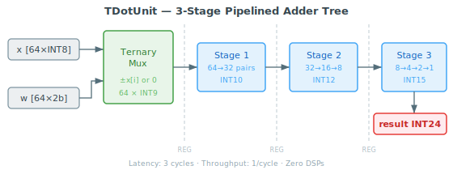

The core arithmetic primitive. Computes `dot(x, w) = Sigma(x[i] * w[i])` where `x` is 64 INT8 values and `w` is 64 ternary values.

Since weights are from {-1, 0, +1}, multiplication is just a mux: select `+x[i]`, `-x[i]`, or `0`. The input `x` is widened to 9 bits (line 35) to safely negate -128 (which has no positive INT8 representation). The 64 mux outputs then flow through a **3-stage pipelined binary adder tree**:

| Stage | Operation | Width | Lines |
|-------|-----------|-------|-------|
| **Stage 1** | Ternary mux (64 values) + first pairwise add (64→32) | 9→10 bits | 32–43, 57–63 |
| **Stage 2** | Two more levels (32→16→8) | 10→11→12 bits | 64–71 |
| **Stage 3** | Three final levels (8→4→2→1) | 12→13→14→15 bits | 72–80 |

The final 15-bit sum is resized to 24 bits for the output register.

The `addPairs()` helper (lines 46–55) implements pairwise addition with automatic width growth: `n` values of width `w` become `n/2` values of width `w+1`.

**Key properties:**
- Zero DSPs — the entire TDotUnit is pure LUT logic
- Latency: 3 cycles (pipeline fill)
- Throughput: 1 dot product per cycle (after fill)
- The 9-level combinational path is split across 3 register boundaries for timing closure

---

## Section 5: The INT8 MAC Array

**Files: `Int8MacUnit.scala`, `Int8MacArray.scala`**

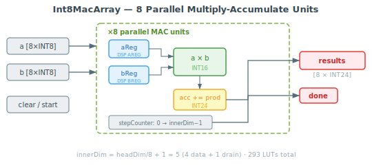

Used for attention score computation (Q dot K^T) and attention-weighted value accumulation (probs dot V), where both operands are INT8 rather than INT8 × ternary.

### 5a: Int8MacUnit

**File: `Int8MacUnit.scala`**

A single multiply-accumulate unit (lines 1–45): `acc += a * b` each cycle.

- **Input pipeline registers** `aReg`/`bReg` (lines 22–23): Designed to map into DSP48E1's internal AREG/BREG, absorbing one pipeline stage into the DSP itself.
- **Product** (line 26): `aReg * bReg` with `use_dsp="yes"` attribute to force DSP inference. (In practice, for 8×8-bit operands, Vivado may still use LUTs — 293 total LUTs for all 8 MACs.)
- **Accumulator** (line 29): 24-bit register, wide enough for worst-case sums.
- **Clear signal**: Zeroes both `aReg`, `bReg`, and the accumulator (lines 30–41) — preventing stale pipeline data from leaking into the first accumulation cycle.

Latency: 2 cycles (input register + product).

### 5b: Int8MacArray

**File: `Int8MacArray.scala`**

Eight `Int8MacUnit` instances running in parallel (line 34). The array has a simple streaming FSM (lines 47–59):

- `start` resets the step counter and clears all MACs
- Each cycle with `valid=True` feeds one pair of operands and increments the counter
- After `innerDim` steps, `done` asserts

For attention scores: `innerDim = headDim / numDspMacs + 1 = 32/8 + 1 = 5`. The +1 is the **drain cycle** for the DSP input pipeline — without it, the last product never reaches the accumulator.

Each MAC computes a partial sum over its 4-element slice. The Attention module sums all 8 results externally to produce the final dot product.

---

## Section 6: RMSNorm — Integer Normalization

**File: `RMSNorm.scala`** (lines 29–255)

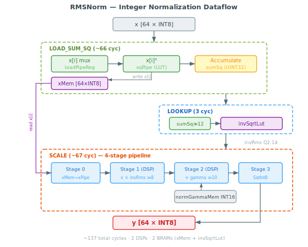

Implements `y[i] = clamp(x[i] / rms(x) * gamma[i] * 64, -128, 127)` in pure integer arithmetic.

### FSM: IDLE → LOAD_SUM_SQ → LOOKUP → SCALE → DONE

**1. LOAD_SUM_SQ (~66 cycles)**

A 3-stage pipeline:
- **Stage 1** (lines 64–66): Mux-select `x[i]` from the input vector, register into `loadPipeReg`.
- **Stage 2** (lines 70–71): Compute `x[i]^2` into `sqPipe` register. The explicit pipeline register here breaks a 9-level combinational path (square + accumulate). The square uses `use_dsp="no"` to keep it in LUTs — saving a DSP for the more critical SCALE multiplies.
- **Stage 3**: Accumulate `sqPipe` into `sumSq` (line 57). Also writes `x[i]` into `xMem` BRAM (64 entries, line 50) for later use in SCALE.

**2. LOOKUP (3 cycles)**

Computes `meanSq = sumSq >> 6` (divide by 64), then `lutIdx = meanSq >> 6` (line 173) — a 256-entry index into the `invSqrtLut` BRAM (line 106). This LUT stores `round(16384 / sqrt(bin_midpoint))` in Q2.14 format: `invRms = invSqrtLut[lutIdx]`.

The LUT index computation is deferred to the LOOKUP state's step 0 to avoid an off-by-one error: a same-cycle write to `sumSq` means the register reads the old value if addressed immediately.

**3. SCALE (~67 cycles)**

A 4-stage pipeline reads `x[i]` from `xMem` and gamma from the external `normGammaMem`:
- **Stage 0** (lines 79–82): Prime BRAM addresses, capture `xReadPipe` and `gammaPipe0`. This breaks the BRAM→DSP path.
- **Stage 1** (lines 84–87): `prod1 = x[i] * invRms` (INT8 × INT16 → INT24, one DSP).
- **Stage 2** (lines 90–92): `prod2 = (prod1 >> 8) * gamma[i]` (INT16 × INT16 → INT32, second DSP).
- **Stage 3**: `y[i] = SatInt8(prod2 >> 10)`.

The combined shift of 18 (8 + 10) instead of the "natural" 24 provides the **×64 scale-up** that fills the INT8 output range. Without this, the normalized values would be fractional and quantize to mostly zeros.

**Totals:** ~137 cycles. 2 DSPs (one per multiply stage). 2 BRAMs (xMem + invSqrtLut).

**Gamma storage**: All gammas live in the shared `normGammaMem` in `ZyboGPTTop`. The `TransformerLayer` computes the full address = `normGammaBase + localOffset`, where `normGammaBase` is set per norm invocation (attention norm vs FF norm vs final norm).

---

## Section 7: Softmax — Integer Probability

**File: `Softmax.scala`** (lines 24–300)

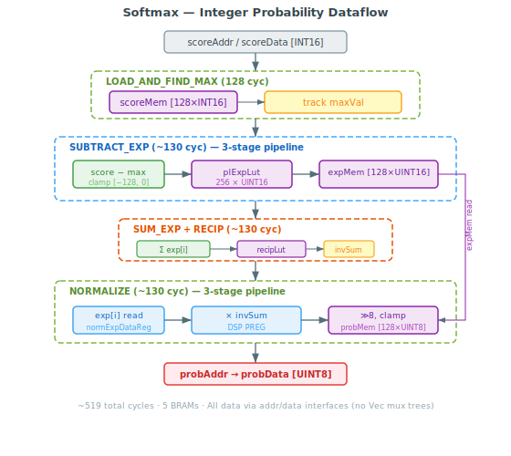

Converts INT16 attention scores to UINT8 probabilities (0–255, approximately summing to 256).

### FSM: IDLE → LOAD_AND_FIND_MAX → SUBTRACT_EXP → SUM_EXP → RECIP → NORMALIZE → DONE

**1. LOAD_AND_FIND_MAX (128 cycles)**

Copies scores from Attention's `scoreMem` (via the `scoreAddr`/`scoreData` interface) to an internal `scoreMem` BRAM (line 51), tracking `maxVal`. Uses the read-ahead pattern: IDLE primes `io.scoreAddr = 0` so the first processing cycle gets data immediately.

**2. SUBTRACT_EXP (~130 cycles)**

A 3-stage pipeline:
- **Stage 1** (lines 64–67): Read from internal `scoreMem`, compute `shifted = score - maxVal`.
- **Stage 2** (lines 70–72): Clamp `shifted` to [-128, 0], use as index into `plExpLut` (256-entry BRAM, line 85).
- **Stage 3** (line 217): Write LUT result to `expMem` (line 46).

The piecewise-linear exp approximation (`plExpLut`) has 4 segments:

| Range | Formula | Rationale |
|-------|---------|-----------|
| `shifted >= 0` | 256 | Max score gets full weight |
| `[-3, 0)` | `256 + shifted*64` | Steep gradient near zero |
| `[-8, -3)` | `64 + (shifted+3)*11` | Moderate decay |
| `[-24, -8)` | `shifted + 24` | Gentle tail |
| `< -24` | 0 | Truncated — negligible probability |

**3. SUM_EXP (128 cycles)**

Accumulates all exp values from `expMem` into `expSum`.

**4. RECIP (2 cycles)**

Looks up `invSumVal = recipLut[expSum >> 7]` — a 256-entry BRAM (line 120) storing `round(65536 / bin_midpoint)`.

**5. NORMALIZE (~130 cycles)**

A 3-stage pipeline:
- **Stage 1** (lines 94–96): Read `exp[i]` from `expMem`, register into `normExpDataReg`.
- **Stage 2** (lines 97–99): `normProductReg = exp[i] * invSumVal`. This register maps to DSP48E1's **PREG** — reducing the CLK-to-P delay from ~4ns to ~0.4ns, critical for timing closure.
- **Stage 3** (line 285): `prob[i] = clamp((normProductReg >> 8), 0, 255)`, written to `probMem` (line 54).

**Totals:** ~519 cycles. 5 BRAMs (scoreMem, expMem, plExpLut, recipLut, probMem). Score and probability data flow through address/data BRAM interfaces — no Vec mux trees.

---

## Section 8: Attention — The Core of the Transformer

**File: `Attention.scala`** (lines 23–517)

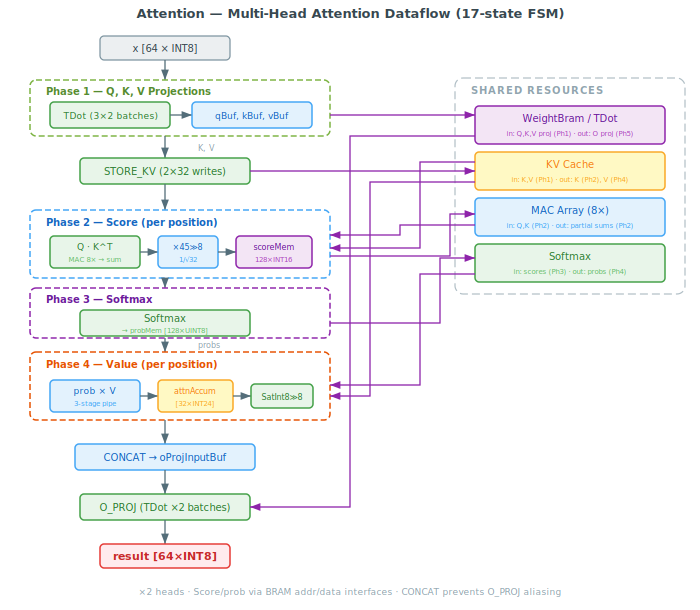

The most complex module with a **17-state FSM** (lines 72–76). For each of 2 attention heads:

### Phase 1: Linear Projections (Q, K, V, O via TDot)

**Q_PROJ, K_PROJ, V_PROJ**: Each projection is 2 TDot batches (64 outputs / 32 per TDot = 2). Results stored in `qBuf`, `kBuf`, `vBuf` — Vec registers of 64 × INT8 each (lines 88–90). Weight addresses increment by `bytesPerTdotLoad` (412 bytes) per batch, with `projAddr` registered (line 180) to eliminate multiply chains in the address path.

A `saturatedTdotResults` array (lines 142–144) pre-computes `SatInt8()` for all 32 TDot outputs, avoiding duplicate clamping logic per branch.

**STORE_KV**: Writes K and V vectors to the KV cache — 32 serialized BRAM writes per head. A `kvWaitCounter` (line 98) ensures the full `headDim` cycles complete before proceeding.

### Phase 2: Score Computation (Q dot K^T via MAC array)

For each cached position `posIdx` from 0 to the current position:

- **ATTN_SCORE**: Issues a KV cache read request, waits for data via `readPending` flag (line 101) to prevent overlapping reads.
- **ATTN_SCORE_MAC**: Feeds Q and K slices into the 8-lane MAC array over 5 steps (4 data + 1 drain). The MAC `innerDim = headDim / numDspMacs + 1 = 5`.
- **ATTN_SCORE_SUM**: Sums 8 MAC results into `macSumReg` (pipeline stage 2, line 132). This breaks the DSP-to-adder critical path.
- **ATTN_SCORE_WRITE**: Scales by `×45 >> 8` (approximating `1/sqrt(32)` = 0.177, since 45/256 = 0.176), writes to `scoreMem` (line 93). This is pipeline stage 3 (line 133).

The compile-time constant indexing for `headIdx` (lines 262–265) is unrolled for `nHeads=2`, eliminating dynamic mux trees.

### Phase 3: Softmax

- **SCALE_MASK → SOFTMAX_WAIT**: Triggers the Softmax module, waits for completion. Score and probability data flow through address/data BRAM interfaces between the two modules.

### Phase 4: Value Accumulation (probs dot V via serialized multiply)

For each cached position:

- **ATTN_VALUE**: Reads V from KV cache, reads probability from Softmax's `probMem`. The probability is registered into `probReg` (line 104) to break the BRAM→DSP path.
- **ATTN_VALUE_CALC**: 3-stage pipeline processing 4 batches of 8 dimensions:
  - **Stage 1** (lines 115–117): Mux V slice into `vSlicePipe` register (breaks readBufV→mux→DSP).
  - **Stage 2** (lines 121–123): `productPipe = probSigned * vSlicePipe`. The prob is zero-extended from UInt8 to 9-bit SInt (`prob.resize(9 bits).asSInt`) for narrower multipliers.
  - **Stage 3** (line 126): `attnAccum[d] += productPipe` — 32 INT24 accumulators.
- **ATTN_VALUE_FINAL**: `SatInt8(attnAccum[d] >> 8)` → `attnOutBuf` (line 94).

### Phase 5: Output Projection

- **CONCAT** (line 486–489): Snapshots `attnOutBuf → oProjInputBuf` (line 95). This prevents **in-place aliasing** where O_PROJ batch 0 writes to `attnOutBuf[0..31]`, corrupting the input for batch 1.
- **O_PROJ**: 2 TDot batches using `oProjInputBuf` as input, result back to `attnOutBuf`.

---

## Section 9: Feed-Forward Network

**File: `FeedForward.scala`** (lines 17–238)

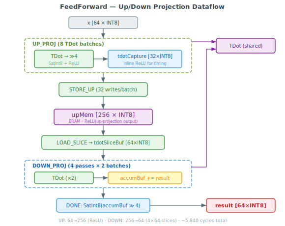

Two linear projections with ReLU activation between them. Up-projects from 64 → 256, then down-projects from 256 → 64.

### FSM: IDLE → UP_PROJ → STORE_UP → LOAD_SLICE → DOWN_PROJ → DONE

### UP_PROJ (8 TDot batches)

Each batch produces 32 INT24 results. **ReLU is inlined in the capture** (lines 108–115): `max(0, SatInt8(result >> 4))`. This hoists SatInt8+ReLU out of the BRAM write path — if it were in STORE_UP, the critical path would be `32-to-1 mux → SatInt8 → BRAM write`, which fails timing. Instead, `tdotCapture` stores already-clamped INT8 values (line 47).

**STORE_UP**: Serializes 32 writes per batch from `tdotCapture` into `upMem` (256-entry INT8 BRAM, line 43).

Weight addresses are pre-registered (`upProjAddr`, line 72) to eliminate an 8-level multiply chain in the address computation.

### DOWN_PROJ (8 TDot invocations = 4 passes × 2 batches)

The down projection is `W_down[64x256] dot upMem[256]`. Since TDot width is 64 and the input is 256, it needs **4 passes** over 64-element slices, accumulating partial results into `accumBuf` (64 × INT24, line 53). Each pass:

1. **LOAD_SLICE**: Pre-reads 64 elements from `upMem` into `tdotSliceBuf` (register file, line 50) using the read-ahead pattern — `upMemAddr` is primed before the transition (line 137), so `readIdx=0` gets immediate data.
2. **DOWN_PROJ**: 2 TDot batches per pass (64 outputs / 32 per TDot). The `batchIdx` is unrolled at compile time (lines 186–196) to avoid dynamic indexing.

**DONE state** (lines 231–232): `resultBuf[i] = SatInt8(accumBuf[i] >> 4)`. This quantization is placed in the DONE state rather than the last DOWN_PROJ cycle because `accumBuf` is a register that needs 1 cycle to settle after the final partial sum write.

---

## Section 10: KV Cache

**File: `KvCache.scala`** (lines 17–126)

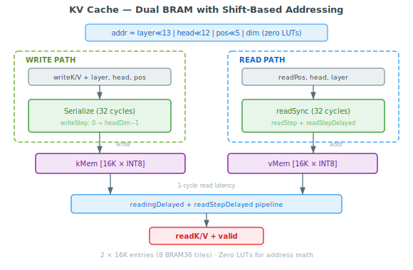

Two BRAMs (`kMem`, `vMem`, lines 43–44) storing all K/V vectors for all layers, heads, and positions. Total: 2 × 16,384 INT8 entries = 32 KB (mapped to 8 BRAM36 tiles).

Dimensions: `nLayers(2) × nHeads(2) × ctxLen(128) × headDim(32) = 16,384` entries per cache.

### Address Computation (Pure Bit Shifts)

```
addr = layer[0] << 13 | head[0] << 12 | pos[6:0] << 5 | dim[4:0]
```

All dimensions are powers of 2 (lines 53–58), so multiplication becomes left-shift and the bit fields don't overlap, allowing OR instead of ADD. **Zero DSPs, zero LUTs** for address math.

| Field | Bits | Shift | Range |
|-------|------|-------|-------|
| layer | 1 | <<13 | 0, 8192 |
| head | 1 | <<12 | 0, 4096 |
| pos | 7 | <<5 | 0–4064 |
| dim | 5 | <<0 | 0–31 |

### Serialized Read/Write

Both reads and writes are serialized over 32 cycles — one `headDim` element per cycle:

- **Write** (lines 60–80): `writeStep` counter, directly indexes from `io.writeK`/`io.writeV` held stable by Attention during STORE_KV. No write buffers needed.
- **Read** (lines 82–125): `readStep` counter with `readSync` BRAM reads. A `readStepDelayed`/`readingDelayed` pipeline (RegNext) accounts for the 1-cycle read latency. Results stored in `readBufK`/`readBufV` registers.

---

## Section 11: Embedding and Logit Computation

**File: `Embedding.scala`** (lines 17–241)

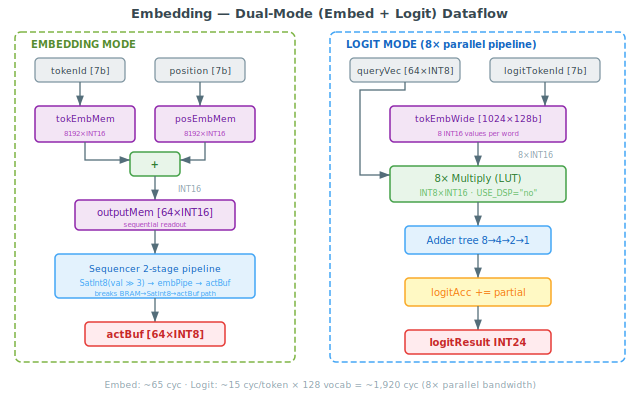

A dual-purpose module with two modes:

### Embedding Mode (EMBED phase)

Looks up token and position embeddings from two BRAMs:
- `tokEmbMem`: 8,192 × INT16 (128 vocab × 64 dims, line 38)
- `posEmbMem`: 8,192 × INT16 (128 positions × 64 dims, line 39)

For all 64 dimensions, computes `tokEmbMem[tokenId*64 + i] + posEmbMem[position*64 + i]` and writes the INT16 sum to `outputMem` (64 entries, line 93). The 2-cycle BRAM readSync latency means the loop takes ~65 cycles.

The Sequencer then reads `outputMem` via a **2-stage pipeline** (`embPipeData`/`embPipeIdx`/`embPipeValid` registers in Sequencer.scala:77–85) that breaks the BRAM → SatInt8 → actBuf critical path. Each value is quantized as `SatInt8(value >> 3)` to convert Q5.10 fixed-point to INT8.

### Logit Mode (OUTPUT_LOGITS phase)

Computes `dot(actBuf, tokEmb[vocabIdx])` for all 128 vocab entries — a dot product of the 64-element INT8 activation vector against each INT16 embedding row. Uses an **8-way parallel pipeline**:

1. **Capture** (lines 172–192): Read one 128-bit word from `tokEmbWide` BRAM (8 × INT16 packed, line 57). Extract 8 query vector elements via a compile-time constant `switch` statement (lines 180–188) to avoid a 64-to-1 mux.

2. **Multiply** (lines 195–202): 8 parallel INT8 × INT16 products. Critically, `USE_DSP = "no"` (line 150) prevents DSP cascade inference — without this attribute, `Flow_AreaOptimized_high` aggressively chains DSPs even across register boundaries, causing -12.7ns WNS.

3. **Adder tree** (lines 205–212): Balanced 3-level reduction: 8 → 4 → 2 → 1.

4. **Accumulate** (lines 215–217): Add partial sum into `logitAcc`.

8 groups × ~2 cycles each = ~15 cycles per logit. 128 vocab × 15 = **~1,920 cycles** total (down from ~8,704 with sequential computation — a 77% reduction).

`tokEmbWide` is a duplicate of `tokEmbMem` repacked into 128-bit words (1,024 entries, lines 55–74). This BRAM duplication trades area for 8× read bandwidth.

---

## Section 12: Temperature Sampling

**File: `SamplingUnit.scala`** (lines 27–225)

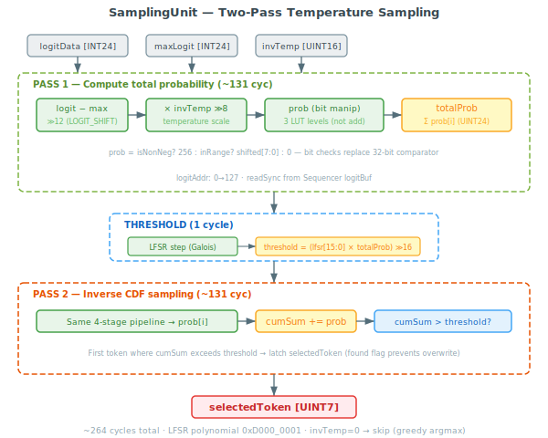

Only invoked when `invTemp > 0` (otherwise the Sequencer uses greedy argmax from the logit computation phase).

### Two-Pass Algorithm with Galois LFSR

**FSM: IDLE → PASS1 → THRESHOLD → PASS2 → DONE**

**PASS1 (~131 cycles)**: Compute total probability mass over all 128 logits. A 4-stage pipeline per logit:

| Stage | Operation | Lines |
|-------|-----------|-------|
| 1 | `diff = logit - maxLogit`, `diffScaled = diff >> 12` | 70–72 |
| 2a | `shifted = (diffScaled * invTemp) >> 8` | 74–76 |
| 2b | `prob = clamp(256 + shifted, 0, 256)` via bit manipulation | 98–112 |
| 2 | Latch prob into pipeline register | 78–80 |

The **LOGIT_SHIFT of 12** (line at constant declaration) is critical: INT24 logits are ~4096× larger than float-scale values due to INT8×INT16 accumulation throughout the network. Without this shift, temperature > 0 sampling always degenerates to greedy output because all probabilities saturate.

The probability clamping in stage 2b uses **bit manipulation** (3 LUT levels) instead of a 32-bit add+compare (9 carry levels):
- `isNonNeg = !shifted.msb` → prob = 256
- `inRange = shifted[30:8].andR` (true iff value is in [-256, -1]) → prob = shifted[7:0] (since 256 + shifted for values in [-256,-1] equals shifted[7:0])
- Otherwise → prob = 0

Accumulate all probabilities into `totalProb` (line 151). Drain condition at step > 128 waits for all pipeline stages to flush.

**THRESHOLD (1 cycle)**: Step the Galois LFSR (polynomial `0xD000_0001`, period 2^32 - 1, lines 167–175). Compute `threshold = (newLfsr[15:0] * totalProb) >> 16` (line 181) — a random fraction of the total probability. **Critical**: must use `newLfsr` (post-step), not the old LFSR value.

**PASS2 (~131 cycles)**: Same pipeline as PASS1, but accumulates `cumSum`. The first token where `cumSum > threshold` is selected (inverse CDF sampling, lines 198–201). The `found` flag (line 62) latches to prevent overwriting the selection.

**Total overhead**: ~264 cycles. The LFSR persists across calls (so consecutive tokens get different random values) and can be reseeded via the AXI SEED register.

**Temperature convention**: `invTemp = 65536 / round(T * 256)`. For example, T=0.5 → invTemp=512. The default T=0.5 is used because greedy decoding produces degenerate repetition at this model size.

---

## Section 13: The Transformer Layer

**File: `TransformerLayer.scala`** (lines 11–230)

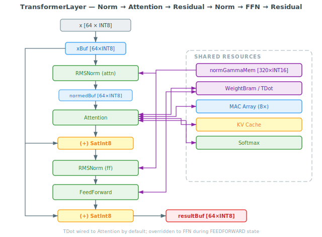

Orchestrates one decoder layer: `x → attn_norm → attention → residual → ff_norm → ffn → residual`.

### FSM: IDLE → ATTN_NORM → ATTENTION → ATTN_RESIDUAL → FF_NORM → FEEDFORWARD → FF_RESIDUAL → DONE

The layer stores three 64-element register buffers:
- `xBuf` (line 72): Original input, preserved for residual connections
- `normedBuf` (line 73): RMSNorm output, fed to Attention/FFN
- `resultBuf` (line 74): Final output of the layer

**TDot interface sharing**: The TDot bus is shared between Attention and FeedForward. By default it's wired to Attention; during the FEEDFORWARD state, a SpinalHDL `override` (lines 202–209) routes it to FFN instead. This works because they never run concurrently — the FSM guarantees mutual exclusion.

**MAC array**: Always driven by Attention (no override needed for FFN, which doesn't use MACs).

**Gamma base address**: Computed at state transitions:
- ATTN_NORM: `normGammaBase = layerIdx * 2 * dModel` (lines 154–156)
- FF_NORM: `normGammaBase = layerIdx * 2 * dModel + dModel` (lines 185–188)

The full gamma address output to `normGammaMem` is `normGammaBase + rmsNorm.io.gammaAddr` (line 86).

**Residual connections**: `SatInt8(xBuf[i] + result[i])` (lines 181–182, 219–220) — the saturating clamp prevents overflow from INT8 addition (e.g., 100 + 100 = 127, not -56).

---

## Section 14: The Sequencer — Master Controller

**File: `Sequencer.scala`** (lines 1–263)

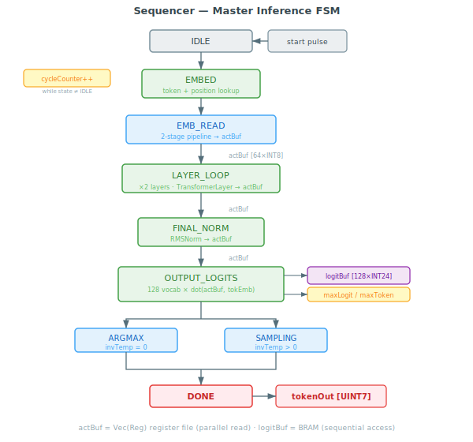

The top-level inference FSM. Drives everything.

### FSM: IDLE → EMBED → EMB_READ → LAYER_LOOP → FINAL_NORM → OUTPUT_LOGITS → ARGMAX/SAMPLING → DONE

| State | Lines | Description |
|-------|-------|-------------|
| **IDLE** | 131–137 | Waits for `start` pulse. Resets cycle counter. |
| **EMBED** | 139–150 | Triggers embedding lookup for `tokenIn` at `positionIn`. Waits for `embDone`. |
| **EMB_READ** | 152–181 | 2-stage pipeline reads `outputMem` sequentially. Stage 1: BRAM read → SatInt8 → `embPipeData`/`embPipeIdx`. Stage 2: `embPipeData` → `actBuf[embPipeIdx]`. Transitions when pipeline fully drained. |
| **LAYER_LOOP** | 183–194 | Starts `TransformerLayer` with current `actBuf`. On completion, copies result back to `actBuf`. Increments `layerCounter`. After 2 layers → FINAL_NORM. |
| **FINAL_NORM** | 196–208 | Applies final RMSNorm to `actBuf`. On completion, copies result back. |
| **OUTPUT_LOGITS** | 210–240 | Iterates over all 128 vocab entries. For each, triggers logit dot product via Embedding (logit mode). Stores result in `logitBuf` BRAM (line 224). Tracks `maxLogit`/`maxToken` for greedy argmax. On completion → SAMPLING (if `invTemp != 0`) or ARGMAX. |
| **ARGMAX** | 242–245 | Sets `tokenOut = maxToken` (already computed during OUTPUT_LOGITS). → DONE. |
| **SAMPLING** | 247–254 | Triggers `SamplingUnit`. On `sampler.io.done`, sets `tokenOut = sampler.io.selectedToken`. → DONE. |
| **DONE** | 256–260 | Asserts `done` for 1 cycle. → IDLE. |

**Key data structures:**
- `actBuf` (line 75): A 64-element Vec(Reg) register file — **not** BRAM, because multiple consumers (transformer layer, final norm, logit computation) need to read the full vector simultaneously.
- `logitBuf` (line 94): A 128-entry BRAM of SInt(24 bits) — sequential access only. Written during OUTPUT_LOGITS, read by SamplingUnit via `readSync` at `sampler.io.logitAddr`.
- `cycleCount` (line 72): Increments while `state != IDLE`, reported via AXI for benchmarking.

---

## Section 15: Putting It All Together — Full Token Inference

A complete forward pass for one token at position `pos`:

| Phase | Approx. Cycles | Description |
|-------|---------------|-------------|
| EMBED | ~65 | Token + position embedding lookup (64 BRAM reads with 2-cycle latency) |
| EMB_READ | ~66 | Pipeline read from outputMem into actBuf (64 elements + pipeline drain) |
| **Layer 0** | | |
| ATTN_NORM | ~137 | RMSNorm: 66 load+square + 3 lookup + 67 scale |
| Q/K/V_PROJ | ~1,095 | 3 projections × 2 batches × ~183 cycles (103 load + ~80 compute) |
| STORE_KV | ~64 | 2 heads × 32 serialized writes |
| ATTN_SCORE | ~varies | (pos+1) positions × ~15 cycles each (MAC array + pipeline) |
| SOFTMAX | ~519 | 128 load + 130 sub_exp + 128 sum + 2 recip + 130 normalize |
| ATTN_VALUE | ~varies | (pos+1) positions × ~15 cycles each (prob × V accumulation) |
| O_PROJ | ~730 | CONCAT + 2 TDot batches |
| ATTN_RESIDUAL | 1 | SatInt8(xBuf + attnOut) |
| FF_NORM | ~137 | RMSNorm |
| UP_PROJ | ~2,920 | 8 batches × (103 load + ~80 compute + 32 store) |
| DOWN_PROJ | ~2,920 | 4 passes × (64 load_slice + 2 batches × ~183 compute) |
| FF_RESIDUAL | 1 | SatInt8(xBuf + ffnOut) |
| **Layer 1** | ~same | Repeat all of Layer 0 |
| FINAL_NORM | ~137 | RMSNorm |
| OUTPUT_LOGITS | ~1,920 | 128 vocab × ~15 cycles (8× parallel pipeline) |
| ARGMAX or SAMPLING | 1 or ~264 | Greedy or temperature sampling |

**Measured cycle counts** (from simulation):
- Position 0: **24,987 cycles** → 6,005 tok/s at 150 MHz
- Position 15: **30,019 cycles** → 4,998 tok/s at 150 MHz
- Average: **~27,439 cycles** → 5,468 tok/s at 150 MHz
- Growth: ~344 cycles per position (linear, from KV cache reads scaling with sequence length)

**On-hardware**: 3,072 tok/s (BENCH), lower than simulation due to AXI bus overhead and PS↔PL latency.

---

## Section 16: Resource Budget

Vivado post-implementation utilization on xc7z010clg400-1:

| Resource | Used | Available | Util% | Primary Consumers |
|----------|------|-----------|-------|-------------------|
| LUTs | 14,952 | 17,600 | 85% | TDotUnit adder tree, Attention FSM, Sequencer muxing, WeightBram assembly |
| Registers | 13,317 | 35,200 | 38% | Pipeline regs, actBuf, Q/K/V buffers, accumulator arrays |
| BRAM36 | 30.5 | 60 | 51% | WeightBram (5), Embeddings (12), KV cache (8), LUTs+norms (~5.5) |
| DSP48E1 | 67 | 80 | 84% | RMSNorm (2 per invocation × 3 invocations), Softmax normalize, MAC array (8), attention scale ops |

**Timing**: WNS = -0.076ns at 150 MHz (36 endpoints failing in Vivado's slow-corner model). Works reliably in practice — ran 377 benchmark rounds / 45K tokens without errors at room temperature.

**Synthesis strategy**: `Flow_AreaOptimized_high` — aggressively maps arithmetic to DSPs to save LUTs. **Implementation strategy**: `Performance_Explore`.

**Key timing fixes applied** (WNS progression: -1.398 → -0.076):
1. RMSNorm `sqPipe` register breaks square+accumulate path
2. Int8MacUnit `aReg`/`bReg` absorbed into DSP48E1 AREG/BREG
3. FeedForward `upProjAddr` registered to eliminate multiply chain
4. TDotUnit 3-stage pipeline (was 2-stage) for adder tree
5. FeedForward SatInt8+ReLU hoisted from STORE_UP to UP_PROJ capture
6. Softmax `normProductReg` maps to DSP48E1 PREG
7. SamplingUnit bit-manipulation probability (3 LUT levels vs 9 carry levels)
8. Sequencer `embPipeData`/`embPipeIdx` pipeline registers

### BRAM Allocation Detail

| Consumer | Tiles | Contents |
|----------|-------|----------|
| WeightBram (weightMem) | 5 | 19,776 bytes packed ternary weights |
| Token embeddings (tokEmbMem + tokEmbWide) | 8 | 128×64 INT16 + 128-bit wide duplicate |
| Position embeddings (posEmbMem) | 4 | 128×64 INT16 |
| KV cache (kMem + vMem) | 8 | 2 × 16K INT8 entries |
| Softmax LUTs + buffers | ~3 | plExpLut, recipLut, expMem, scoreMem, probMem |
| RMSNorm (xMem + invSqrtLut) | ~1.5 | 64 INT8 + 256 UINT16 |
| normGammaMem | ~0.5 | 320 INT16 entries |
| Sequencer logitBuf | ~0.5 | 128 INT24 entries |
| **Total** | **~30.5** | |
